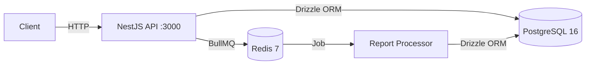
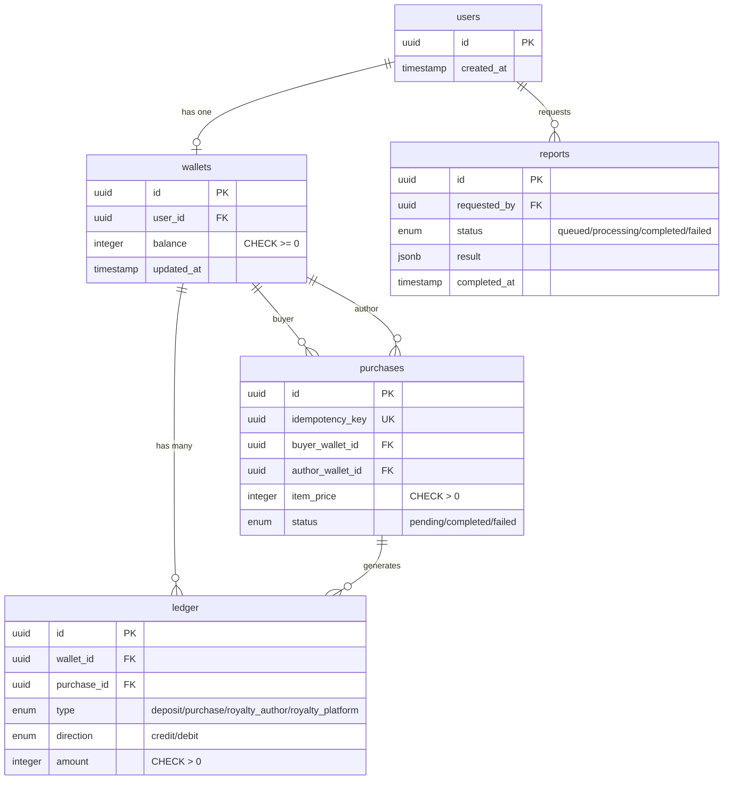

# Architecture

## Overview

Wallet is a digital wallet API that manages integer-cent balances, purchase transactions with royalty splits, and async financial reporting. The system prioritises correctness under concurrency over raw throughput — every balance mutation uses pessimistic locking and SQL-side arithmetic to prevent double-spending and race conditions.

## System Context

## Module Structure

| Module          | Path                                 | Responsibility                                                 |
| --------------- | ------------------------------------ | -------------------------------------------------------------- |
| AppModule       | `src/app.module.ts`                  | Root module — imports all domains, registers global middleware |
| DbModule        | `src/common/database/db.module.ts`   | Drizzle ORM connection via `postgres` driver                   |
| LoggerModule    | `src/common/logger/logger.module.ts` | Pino logger (JSON in prod, pino-pretty in dev)                 |
| WalletsModule   | `src/wallets/wallets.module.ts`      | Deposit funds into user wallets                                |
| PurchasesModule | `src/purchases/purchases.module.ts`  | Purchase items with royalty splits across 3 wallets            |
| ReportsModule   | `src/reports/reports.module.ts`      | Async financial report generation via BullMQ                   |

## Request Lifecycle

1. **Express** receives the HTTP request
2. **CorrelationIdMiddleware** extracts or generates `X-Request-Id`, attaches it to the Pino logging context
3. **UserIdGuard** (per-controller) validates the `X-User-Id` header as a UUID and attaches it to `req.userId`
4. **ValidationPipe** (global) transforms and validates the request body against the DTO class (`whitelist`, `forbidNonWhitelisted`, `transform`)
5. **Controller** delegates to the service layer
6. **Service** executes business logic within a database transaction
7. **Response** is serialised and returned with the correlation ID

## Data Model

## Concurrency & Transactions

### Deposits

Each deposit runs inside a transaction that locks the wallet row with `SELECT FOR UPDATE`. The balance update uses SQL-side arithmetic (`balance + $amount`) to eliminate read-then-write races.

### Purchases

A purchase involves three wallets: buyer, author, and platform. All three are locked in a single query ordered by `id ASC` (`FOR UPDATE`) to enforce consistent lock acquisition and prevent deadlocks. Within the same transaction:

1. Buyer balance is decremented by the item price
2. Author receives `floor(price * 70 / 100)` (author royalty)
3. Platform receives the remainder (`price - authorCut`)
4. A purchase record and three ledger entries are inserted

If PostgreSQL detects a deadlock (`40P01`), the service catches it and returns `409 Conflict` with a retry hint.

### Idempotency

Each purchase carries a client-owned `Idempotency-Key` header (UUID). Before entering the transaction, the service checks for an existing purchase with that key:

- **Completed + same payload** — returns the cached result (safe replay)
- **Completed + different payload** — `409 Conflict` (payload drift)
- **Still in flight** — `409 Conflict`

The `idempotency_key` column has a unique constraint — concurrent inserts with the same key trigger `23505 unique_violation`, also surfaced as `409`.

## Async Processing

Financial reports are generated asynchronously:

1. `POST /reports/financial` — inserts a report row with status `queued`, enqueues a BullMQ job, returns `{ jobId, status }`
2. **ReportsProcessor** (BullMQ worker) picks up the job, sets status to `processing`, runs an aggregation query inside a `REPEATABLE READ` transaction, and stores the JSONB result
3. `GET /reports/financial/:jobId` — polls the report status and result, scoped to the requesting user

If Redis is down when enqueuing, the report is immediately marked `failed` rather than left orphaned in `queued`.

## Design Decisions

Architectural decisions are recorded as ADRs:

- [ADR-001: NestJS over Fastify](adr/ADR-001-nestjs-over-fastify.md)
- [ADR-002: PostgreSQL + Drizzle ORM](adr/ADR-002-postgresql-drizzle.md)
- [ADR-003: Integer Cents over NUMERIC](adr/ADR-003-integer-cents.md)
- [ADR-004: Pessimistic Locking over Optimistic](adr/ADR-004-pessimistic-locking.md)
- [ADR-005: Platform Receives Royalty Remainder](adr/ADR-005-platform-royalty-remainder.md)
- [ADR-006: BullMQ for Async Report Generation](adr/ADR-006-bullmq-async-reports.md)
- [ADR-007: Idempotency Key Owned by Client](adr/ADR-007-client-owned-idempotency-key.md)

## Security

- **Ownership scoping** — all queries filter by the authenticated user's ID; accessing another user's resource returns `404` (not `403`) to prevent identifier enumeration
- **UserIdGuard** — validates `X-User-Id` as a UUID on every protected endpoint; rejects with `401` if missing or invalid
- **ValidationPipe** — `whitelist: true` strips unknown properties, `forbidNonWhitelisted: true` rejects them with `400`
- **No raw errors** — all exceptions use NestJS built-in HTTP exceptions; stack traces are never leaked to clients
- **Idempotency key validation** — the `Idempotency-Key` header is validated as a UUID before processing
